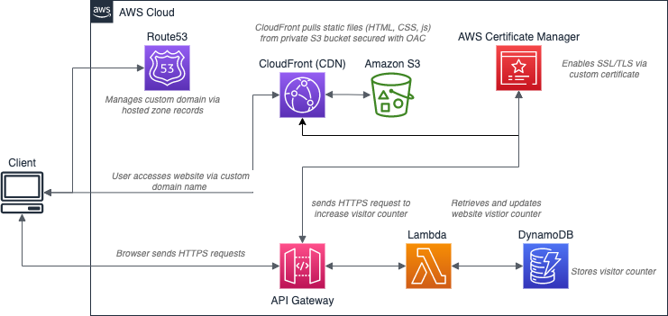

# The Cloud Resume Challenge

## What is this challenge?

## The Architecture

The architecture of the solution follows AWS best practices described in [AWS Serverless White Paper (Multi-Tier Architectures with Amazon API Gateway and AWS Lambda)](https://docs.aws.amazon.com/whitepapers/latest/serverless-multi-tier-architectures-api-gateway-lambda/introduction.html) 

 

I have added some additional configurations:
* S3 buckets that hosts website static files is private and CloudFront access it securely with OAC
* I created this architecture in a multi-account with AWS Organisation and enabled SSO for short term credntials instead of using API keys
* The apex of my domain belongs to management account
* The build and test happen in a member accounts set up for development, test, and production purposes   
## Challenges

In this section, I would like to focus on the tools that I learnt during this challenge and has not tried prior
### Cypress
### CORS
### GitHub Actions integration with AWS

## CI/CD Pipeline

#### resume_challenge_back_end
repository for the back-end resume challenge resources
