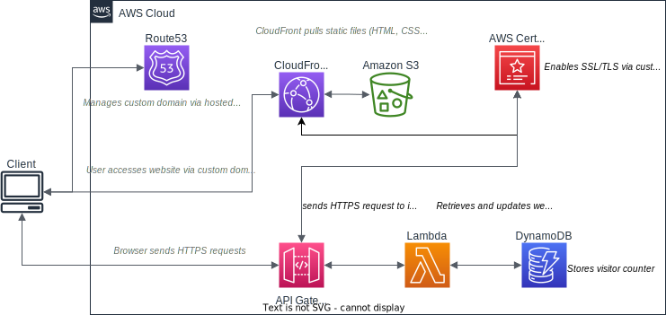
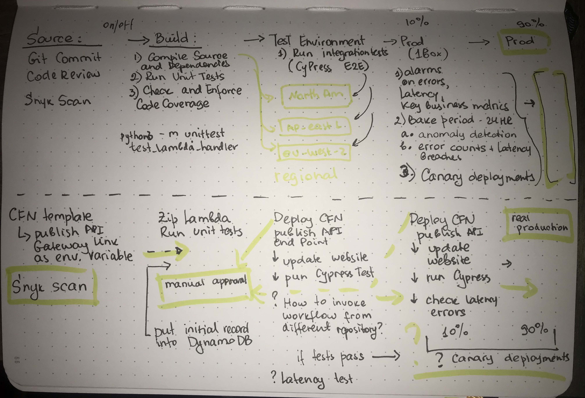

# The Cloud Resume Challenge

## What is this challenge?

## The Architecture

The architecture of the solution follows AWS best practices described in [AWS Serverless White Paper (Multi-Tier Architectures with Amazon API Gateway and AWS Lambda)](https://docs.aws.amazon.com/whitepapers/latest/serverless-multi-tier-architectures-api-gateway-lambda/introduction.html) 

 

I have added some additional configurations:
* S3 buckets that hosts website static files is private and CloudFront access it securely with OAC
* I created this architecture in a multi-account with AWS Organisation and enabled SSO for short term credntials instead of using API keys
* The apex of my domain belongs to management account
* The build and test happen in a member accounts set up for development, test, and production purposes   
## Challenges

In this section, I would like to focus on the tools that I learnt during this challenge and has not tried prior
### Cypress
### CORS
### GitHub Actions integration with AWS

## CI/CD Pipeline

### Infrustructure as Code
Serverless back-end resources as well as related IAM Roles and Policies are provisioned with CloudFormation

### Code Vulnerability Scan
I chose Snyk for Lambda code and IaC template scanning on this repository for vulnerabilities to take informed action prior build phase of the CI/CD pipeline

### The CI/CD Pipeline
GitHub Actions workflow is integrated with AWS as OIDC and obtains a short term credentials to build resources listed in the CloudFormation stack.

#### Back-end Workflow
Back-end workflow performs these steps:
- activated on git push to repository
- checks out the repository
- installs Python dependencies as my Lambda code is written in Python 
- obtains short term credentials from AWS
- runs unit test for the Lambda vistor counter function
- if the unut tests are successful, deploys Lambda into the designated S3 bucket
- deploys CloudFormation stack for the serverless back-end
- updates Lambda code from S3 bucket as catch all if CloudFormation did not detect a change
- initialises DynamoDB with counter item and sets value to 0 if the item does not exist

Caveat: current requirements.txt might list too many libraries which are not required for the installation on GitHub container during deployment phase.
I need to review and reduce the list of dependencies.

#### Front-end Workflow
Another GitHub Actions workflow is configured for the front-end and performs these steps:
- activated on git push to repository
- checks out the repository
- uploads website files from the repository to the designated S3 bucket that is the source for CloudFormation distribution
- invalidates CloudFront distribution cache
- runs end-to-end Cypress integration test veryfying that 
  - visitor counter is present on index.html
  - visitor counter value is increasing by 1 with every hit of the website page 

#### The Ideal CI/CD Pipeline
Ideally, I'd like the pipeline being fully automated for all resources shown in the architecture diagram, as well as incorporating canary deployments.
It might sound as an overkill for now, but it would be a good practice for DevOps mod for corporate clients:

#### resume_challenge_back_end
repository for the back-end resume challenge resources
